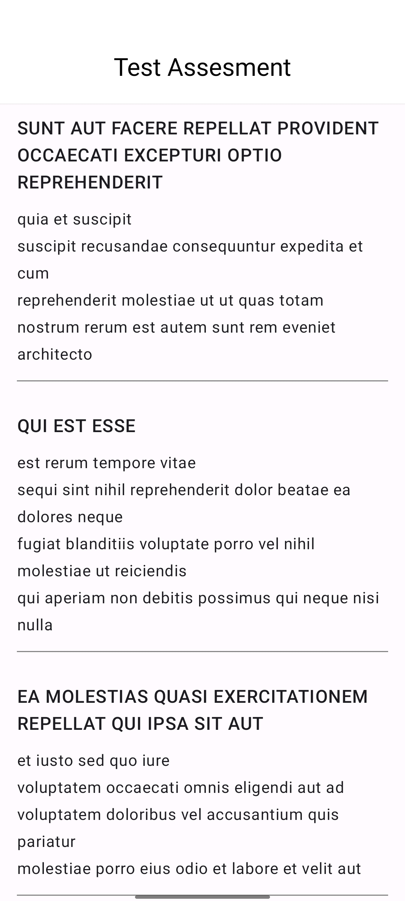

## Tentang Aplikasi

Test Assestment adalah aplikasi androiod untuk memenuhi Test Coding
Aplikasi ini di bangun menggunakan :  
- [x] Kotlin sebagai bahasa Pemrogaman Utama</a>
- [x] Jetpack Compose sebagai UI Layout</a>
- [x] Clean Architecture & MVVM</a>
- [x] Hilt untuk Dependency Injection </a>
- [x] Retrofit2 untuk networking dan konsumsi REST API</a>

Aplikasi ini memiliki beberapa fitur :
- [x] Halaman Daftar data

## Preview Aplikasi

